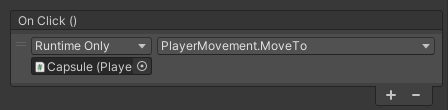
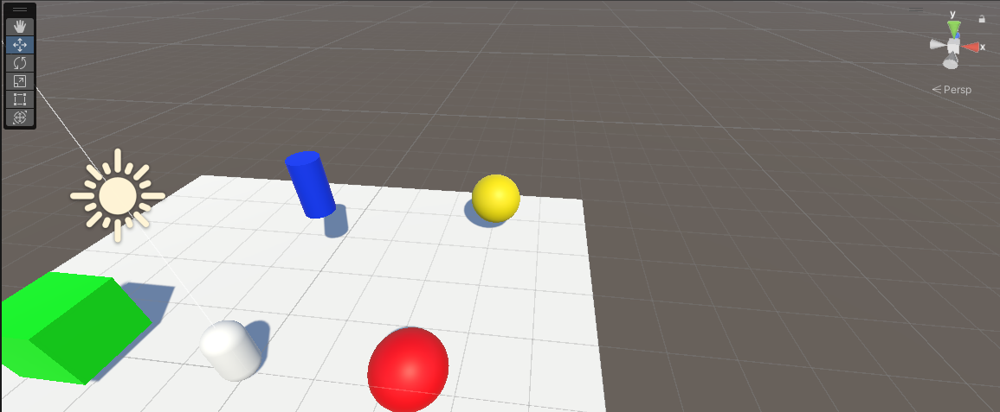

# Eventos

En esta actividad realizaremos pruebas con las diferentes modalidades de uso de eventos para enviar mensajes entre los objetos de la escena en Unity.

Actividades a realizar:

1. Implementar una UI que permita configurar con qué velocidad te moverás: turbo o normal. También debe mostar la cantidad de objetos recolectados y si chocas con alguno especial restar fuerza.
2. Agrega un personaje que al clickar sobre un botón de la UI se dirija hacia un objetivo estático en la escena.
3. Agregar a tu escena un objeto que al ser recolectado por el jugador haga que otros dos objetos en la escena realicen las siguientes acciones: el objeto A se desplaza hacia el jugador. El objeto B se ubica en un punto fijo en la escena.

## Actividad 1

Está actividad yo la dividi en 3 subtareas más, esto lo hoce para ir paso a paso y entender lo que estoy haciendo.

La dividi en las siguientes:

1. Implementar la UI para configurar la velocidad del jugador
2. Añadir un Item que cuando el jugador lo recoja muestra la cantidad de objetos recolectados
3. Por último añadir un objeto especial que reduce la velocidad del jugador

### Subtarea 1

En esta primera subtarea cree el canvas y añadí los dos botones que permiten configurar la velocidad. En la Figura 1 se muestra el ejemplo de como quedaría el evento ```OnClick()``` para el caso del botón de velocidad normal, para el botón turbo es igual pero la velocidad se aumenta a 5.


*Figura 1: Evento de UI pulsando el botón normal*

> Añadir gif 1

En está primera subtarea cree el script de ```PlayerMovement```, por defecto se ve de la siguiente manera y en próximas subtareas lo estaré editando.

```cs
    public class PlayerMovement : MonoBehaviour
    {
        public float speed;

        public void IncreaseSpeed(float amount)
        {
            speed = amount;
            if (speed >= 5)
            {
                Debug.Log("Velocidad turbo activada");
            }

            if (speed < 5)
            {
                Debug.Log("Velocidad normal activada");
            }
        }
    }
```

### Subtarea 2

En esta segunda subtarea añadí un cubo de color verde a la escena y si el jugador toca este cubo se muestra la cantidad de objetos recolectados.

> Añadir gif 1.1

Para poder notificar a la interfaz de este suceso, he creado los scripts de ```Notificator``` y de ```Subscriptor```.

```cs
    [System.Serializable]
    public class ItemCollectedEvent : UnityEvent<int> { }

    public class Notificator : MonoBehaviour
    {
        public ItemCollectedEvent onItemCollected;
        private int itemsCollected;

        void Start()
        {
            itemsCollected = 0;

            if (onItemCollected == null)
            {
                onItemCollected = new ItemCollectedEvent();
            }
        }

        private void OnTriggerEnter(Collider other)
        {
            if (other.CompareTag("Item"))
            {
                itemsCollected++;
                onItemCollected.Invoke(itemsCollected);
                Destroy(other.gameObject);
            }
        }
    }
```

```cs
    public class Subscriptor : MonoBehaviour
    {
        public Notificator myNotificator;
        public Text itemCounterText;

        void Start()
        {
            myNotificator.onItemCollected.AddListener(UpdateItemCounter);
        }

        void UpdateItemCounter(int totalItemsCollected)
        {
            itemCounterText.text = "Items Collected: " + totalItemsCollected.ToString();
        }
    }
```

### Subtarea 3

En esta tercera subtarea añadí una esfera de color rojo a la escena y si el jugador toca este esfera se muestra la cantidad de objetos recolectados y se reduce la velocidad del jugador.

> Añadir gif 1.2

He tenido que modificar el script de ```Notificator``` y ```PlayerMovement``` para que el juego tenga el comportamiento descrito.

```cs
    public class Notificator : MonoBehaviour
    {
        ...
        private void OnTriggerEnter(Collider other)
        {
            if (other.CompareTag("Item"))
            {
                AddItem(other);
            }
            if (other.CompareTag("SpecialItem"))
            {
                AddItem(other);
                this.GetComponent<PlayerMovement>().ReduceSpeed();
            }
        }

        private void AddItem(Collider item)
        {
            itemsCollected++;
            onItemCollected.Invoke(itemsCollected);
            Destroy(item.gameObject);
        }
    }

```

```cs
    public class PlayerMovement : MonoBehaviour
    {
        public void ReduceSpeed()
        {
            speed--;
            Debug.Log("Velocidad Actual -> " + speed);
        }
    }
```

## Actividad 2

Usando la interfaz creada en la actividad anterior añado un botón para poder activar el movimiento independiente del jugador hacía un punto de la escena (Figura 2). 



*Figura 2: Evento que active el movimiento del personaje*

Para activar dicho movimiento he añadido una serie de cambios al script de ```PlayerMovement```. El principal cambios es el movimiento del jugador desde su posición hasta la ubicación objetivo ( En el método```Update()``` se han añadido dichos cambios), pero este movimiento no se hace por defecto si no que es controlado por un booleano. Este booleano se pone a ```true``` cuando el jugador pulse el botón MoveTo y se activa el movimiento (Figura 3).


*Figura 3: UI*

```cs
    public class PlayerMovement : MonoBehaviour
    {
        public float speed;
        public Transform goal;
        private bool canMove = false;

        void Update()
        {
            if (canMove)
            {
                Vector3 direction = goal.position - transform.position;
                Quaternion.Slerp(transform.rotation, goal.rotation, 0.01f);

                transform.Translate(direction * Time.deltaTime * speed, Space.World);
                if (transform.position == goal.position)
                {
                    canMove = false;
                }
            }
        }

        ... 

        public void MoveTo()
        {
            canMove = true;
        }
    }
```

## Actividad 3

Antes de empezar con está actividad he cambiado los scripts relacionados con los eventos para que usen un delegado en vez de usar el ```EventSystem``` de Unity.

```cs
    public class Notificator : MonoBehaviour
    {
        public delegate void ItemCollected(int totalItemsCollected);
        public event ItemCollected onItemCollected;

        private int itemsCollected = 0;

        private void OnTriggerEnter(Collider other)
        {
            if (other.CompareTag("Item"))
            {
                AddItem(other);
            }
            if (other.CompareTag("SpecialItem"))
            {
                AddItem(other);
                this.GetComponent<PlayerMovement>().ReduceSpeed();
            }
        }

        private void AddItem(Collider item)
        {
            itemsCollected++;
            if (onItemCollected != null)
            {
                onItemCollected(itemsCollected);
            }
            Destroy(item.gameObject);
        }
    }
```

```cs
    public class Subscriptor : MonoBehaviour
    {
        public Notificator notificator;
        public Text itemCounterText;

        void Start()
        {
            notificator.onItemCollected += UpdateItemCounter;
        }

        void UpdateItemCounter(int totalItemsCollected)
        {
            itemCounterText.text = "Items Collected: " + totalItemsCollected.ToString();
        }

        void OnDestroy()
        {
            notificator.onItemCollected -= UpdateItemCounter;
        }
    }
```

Posteriormente añado los dos objetos, el objeto A es un cilindro Azul y el objeto B es una esfera azul.



*Figura 3: UI*

En los scripts de ```Notificator``` y ```Subscription``` hago una serie de cambios para poder notificar los eventos del movimiento de los objetos de forma correcta.

```cs
    public class Notificator : MonoBehaviour
    {
        ...
        public delegate void ItemTrigger(GameObject object_A, GameObject object_B);
        public event ItemTrigger onItemTrigger;

        ...
        public GameObject object_A;
        public GameObject object_B;

        private void OnTriggerEnter(Collider other)
        {
            ...
            if(other.CompareTag("ItemTrigger"))
            {
                onItemTrigger(object_A, object_B);
            }
        }
    }
```

```cs
    public class Subscriptor : MonoBehaviour
    {
        public Notificator notificator;

        void Start()
        {
            notificator.onItemCollected += UpdateItemCounter;
            notificator.onItemTrigger += UpdateObjectState;
        }

        ...

        void UpdateObjectState(GameObject object_A, GameObject object_B)
        {
            object_A.gameObject.GetComponent<MoveToPlayer>().MoveTo();
            object_B.gameObject.transform.position = new Vector3(1.0f, object_B.gameObject.transform.position.y, 1.0f);
        }

        void OnDestroy()
        {
            notificator.onItemCollected -= UpdateItemCounter;
            notificator.onItemTrigger -= UpdateObjectState;
        }
    }
```

Para finalizar, hay que mencionar que para mover al **object_A** se le añade el script de ```MoveToPlayer```. Este script es muy similar al de ```PlayerMovement```, pero sin las funciones que configuran la velocidad del jugador.

> Añadir el gif 3